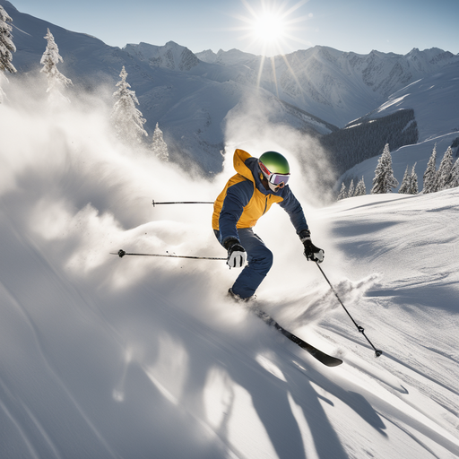
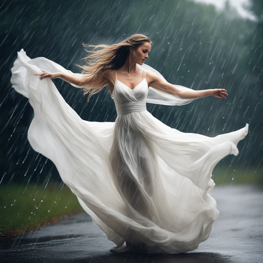
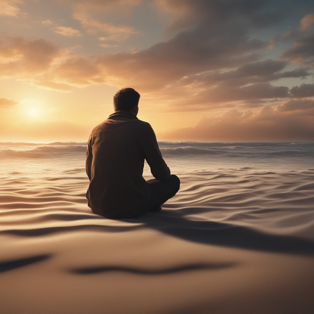

# Prompt Diffusion 🚀

[](https://huggingface.co/abhishek7/Prompt_diffusion-v0.1)


[](https://www.nvidia.com/)
[](https://opensource.org/licenses/Apache-2.0)

|||||
|---------------------------------------|----------------------------------|-----------------------------------------|--------------------------------------|


This model was build via parameter-efficient QLoRA finetuning of [Mistral-7B-v0.1](https://huggingface.co/mistralai/Mistral-7B-v0.1) on a custom dataset.
The goal of this project is to build a model which takes simple and short natural language inputs and generate a highly detailed and descriptive prompt for [Stable Diffusion](https://stability.ai/stable-diffusion) and other similar image generation models.
Hence making it easier for everyone to get high quality images easily.

## Note

>This is the first iteration of this project and it was to check the capabilities of Mistral-7B model.
>As of now the model is fine-tuned mostly on the prompts which includes humans, with description of the subject and the scene.
>This is a work in progress and this is just a prototype. Hence, one can expect issues with response from the model.

## Input Template

```
###Human:
generate a stable diffusion prompt for {input}

###Assistant:
```

## Output Template

```
###Human:
generate a stable diffusion prompt for a model in a cafe sipping coffee

###Assistant:
A model in a cafe sipping coffee, with a warm glow illuminating her face. She wears a stylish dress and has a book in her hand. The background is a cozy cafe with dim lights.
```

## Example prompts and responses

Example 1: 

**User**:

>a model in a cafe sipping coffee

**Prompt Diffusion**

>A model in a cafe sipping coffee, with a warm glow illuminating her face.
She wears a stylish dress and has a book in her hand. The background is a cozy cafe with dim lights.

<br>

Example 2: 

**User**:

>a man skiing

**Prompt Diffusion**

>A man in a ski suit, with a helmet and goggles, is skiing down a snowy mountain, with the wind blowing in his face and the sun shining brightly. 
The man is enjoying the thrill of skiing, as he glides down the slopes, leaving behind a trail of fresh powder.

<br>

Example 3: 

**User**:

>a beautiful woman dancing in rain

**Prompt Diffusion**

>A beautiful woman, dressed in a flowing white gown, dances gracefully in the rain. 
The raindrops fall gently around her, creating a magical and ethereal atmosphere. 
She moves with grace and elegance, her long hair flowing in the wind. 
The rain creates a shimmering effect on her gown, making her look like a goddess.

<br>

Example 4: 

**User**:

>a man on a beach

**Prompt Diffusion**

>A man sits on a beach, the waves crashing against the shore.
The sun is setting, casting a warm glow over the sand and water.
The man is lost in thought, his mind wandering as he takes in the beauty of the scene.

<br>

## Demo

>This code can be run even on the free version of Google Colab. Change the runtime to **GPU - T4** and run the notebook below:

## <a href="https://colab.research.google.com/drive/1NfNA6sYWUG0Nqy42lhyJfUIqDxsrV64d?usp=sharing" target="_blank" style="color: orange; font-weight: bold;">Try on Colab</a> 🚀

## Contributing

Contributions are welcome! If you find any bugs, create an issue or submit a pull request with your proposed changes.

## Contributing

Contributions are welcome! If you find any bugs, create an issue or submit a pull request with your proposed changes.

## License

This project is licensed under the Apache 2.0 License.

## Contact

This model was finetuned by [Abhishek Kalra](https://github.com/abhishek7kalra) on Sep 29, 2023 and is for research applications only.

[](mailto:abhishek7.kalra@gmail.com)


